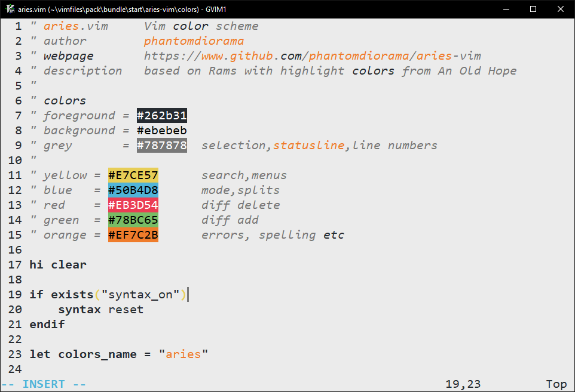
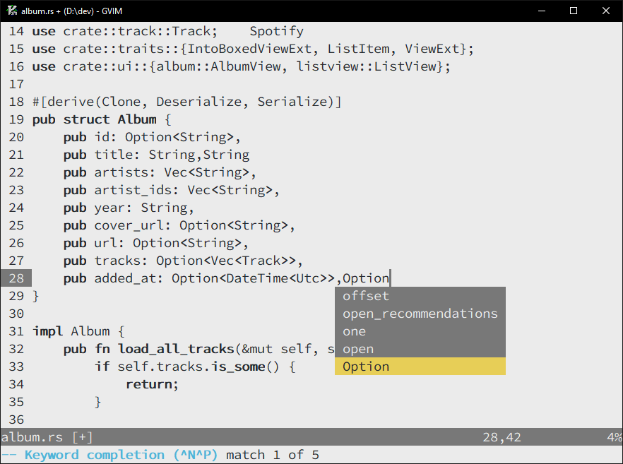

# aries-vim

A light minimal vim colorscheme based on [Rams](https://github.com/stefanvanburen/rams.vim) with highlight colors from [An Old Hope](https://github.com/jesseleite/an-old-hope-syntax-atom). 

Sheep + space = Aries

## Status
Very much WIP

## Requirements
Choose a font with good **bold** definition.

 
